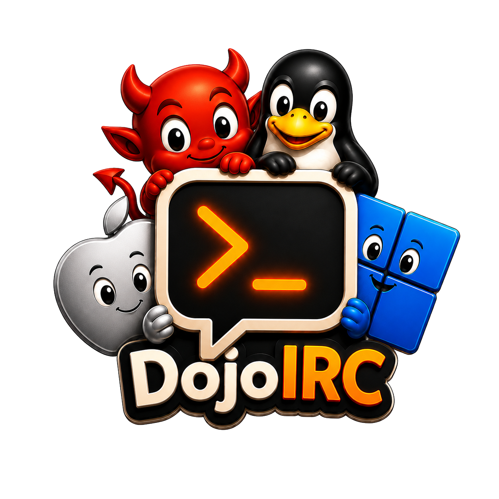
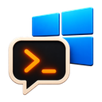

<div align="center">
  
  <p>A fast, cross-platform IRC client built with Go and Wails v2.</p>
  <p>
    
    
    
    
  </p>

  <br>

  <a href="https://github.com/joehonkey/DojoIRC/releases/latest">
    
  </a>

  <br><br>

  <p><b>Click your OS to download the pre-built binary:</b></p>

  <table>
    <tr>
      <td align="center">
        <a href="https://github.com/joehonkey/DojoIRC/releases/latest/download/DojoIRC-linux-amd64.tar.gz">
          <br>
          <b>Linux</b><br>
          <sub>.tar.gz · x86_64</sub>
        </a>
      </td>
      <td align="center">
        <a href="https://github.com/joehonkey/DojoIRC/releases/latest/download/DojoIRC-windows-amd64.zip">
          <br>
          <b>Windows</b><br>
          <sub>.zip · x86_64</sub>
        </a>
      </td>
      <td align="center">
        <a href="https://github.com/joehonkey/DojoIRC/releases/latest/download/DojoIRC-macos-arm64.tar.gz">
          <br>
          <b>macOS</b><br>
          <sub>.tar.gz · Apple Silicon</sub>
        </a>
      </td>
      <td align="center">
        <a href="docs/building.md#freebsd">
          <br>
          <b>FreeBSD</b><br>
          <sub>build from source</sub>
        </a>
      </td>
    </tr>
  </table>

  <p><sub>All releases: <a href="https://github.com/joehonkey/DojoIRC/releases">github.com/joehonkey/DojoIRC/releases</a></sub></p>

  <br>

  <a href="docs/themes-gallery.md">
    
  </a>
</div>

---

## Documentation

**[Installation](docs/installation.md)** — [Configuration](docs/configuration.md) — [Commands](docs/commands.md) — [Keyboard Shortcuts](docs/keyboard-shortcuts.md) — [Themes](docs/themes.md) — [**Theme Gallery (55 themes)**](docs/themes-gallery.md) — [Font Sizes](docs/font-sizes.md) — [IRCv3](docs/ircv3.md) — [Building from Source](docs/building.md)

---

## About

DojoIRC is a from-scratch IRC client written in Go using [Wails v2](https://wails.io). The backend is a full IRC engine in Go; the frontend is HTML/CSS/JS rendered in a webkit2gtk webview. Inspired by Halloy, built without restrictions.

- **IRC engine** — TLS, SASL PLAIN, NickServ identify, multi-server, auto-reconnect, ignore list, message logging
- **IRCv3** — `message-tags`, `draft/typing`, `server-time`, `away-notify`, CAP LS 302 multiline negotiation
- **Theming** — 55 themes, Catppuccin Mocha default, live switching, custom TOML themes
- **Desktop integration** — system tray, OS notifications, URL preview cards
- **Bouncer support** — ZNC and soju via `password` field in config
- **Cross-platform** — Linux, Windows, macOS, FreeBSD (confirmed on FreeBSD 15 / KDE Plasma 6)

---

## Platform Support

| Platform | Status | Notes |
|---|---|---|
| **Linux** | ✅ Pre-built binary | Requires `webkit2gtk-4.1`. KDE Wayland: run with `GDK_BACKEND=x11` |
| **Windows** | ✅ Pre-built binary | Requires WebView2 (ships with Windows 10/11) |
| **macOS** | ✅ Pre-built binary | Apple Silicon (arm64). Intel: build from source |
| **FreeBSD** | ✅ Build from source | Confirmed on FreeBSD 15 / KDE Plasma 6. Requires patched Wails v2 — see [building guide](docs/building.md#freebsd) |

---

## Features

| Feature | Details |
|---|---|
| **Multi-server** | Connect to as many servers as you want; each has its own sidebar entry |
| **Bouncer support** | ZNC and soju via `password` in config — sends `PASS` before registration; use `user/network:password` for ZNC |
| **TLS** | All connections use TLS by default (port 6697) |
| **SASL PLAIN** | Per-server SASL authentication via `[server.sasl]` config block |
| **NickServ identify** | Auto-identifies with NickServ on connect via `nickserv_password` in config |
| **Channel modes** | Live `+modes` pill in the buffer header; auto-requested on join |
| **Auto-reconnect** | Retries every 10s on unexpected disconnect; right-click to cancel |
| **System tray** | Close to tray, left-click to toggle, right-click to quit |
| **Mentions & highlights** | Nick mentions highlighted in chat with red tint + OS desktop notification |
| **Typing indicators** | IRCv3 `draft/typing` — outgoing debounced, incoming shown above input |
| **URL previews** | Open Graph metadata cards and inline images loaded below links |
| **Nick colorization** | Consistent hash-based color per nick across all buffers |
| **Tab completion** | Nicks (cycles, adds `: ` at line start), slash commands, `:emoji` shortcodes |
| **Theme picker** | Scrollable A–Z list, live switching, choice persisted to config |
| **Draggable panels** | Sidebar and nick list resize handles with width persistence |
| **DM windows** | Click any nick to open a private buffer; right-click to close |
| **Server buffer** | MOTD, connection events, WHOIS output per server |
| **Context menus** | Right-click channels to leave, servers to connect/disconnect |
| **In-app docs** | Full searchable documentation panel via Hamburger → Documentation |
| **About panel** | Hamburger → About DojoIRC — app icon, version, stack, IRCv3 caps, GitHub link |
| **Channel list** | `/list` streams all public channels with user counts and topics; filter and click to join |
| **Away status** | `/away` and `/back` toggle an **away** badge in the input bar; `away-notify` tracks other users |
| **Ignore list** | Per-server `ignore = [...]` in config silently drops messages from unwanted nicks |
| **Message search** | Ctrl+F opens an in-buffer search bar; matching messages stay bright, others dim |
| **Keyboard shortcuts** | Alt+↑↓ navigate channels, Alt+←→ switch servers, Ctrl+F search, Escape close |
| **Scrollback limit** | Configurable per session (`scrollback` in `[behaviour]`); default 5000 messages per buffer |
| **Emoji** | 😊 button opens a picker (7 categories, ~175 emoji, live search); `:shortcode:` converts on send; Tab completes `:word`; button toggleable from hamburger menu |
| **Input history** | Up/Down arrows in the message input cycle through previously sent messages |
| **Message logging** | All messages logged to `~/.config/dojoirc/logs/<server>/<channel>.log` automatically |

---

## IRCv3 Support

| Capability | Status |
|---|---|
| `message-tags` | **Done** — CAP negotiation wired; tags parsed on all inbound messages |
| `draft/typing` | **Done** — outgoing TAGMSG typing indicators (debounced); incoming shown above input |
| `sasl` | **Done** — SASL PLAIN; EXTERNAL planned |
| `server-time` | **Done** — server-supplied timestamps used when available |
| `away-notify` | **Done** — AWAY messages tracked; 305/306 update the away badge in the input bar |
| `batch` | Planned |
| `labeled-response` | Planned |
| `multi-prefix` | Planned |
| `extended-join` | Planned |
| `account-notify` | Planned |
| `invite-notify` | Planned |
| `chghost` | Planned |
| `userhost-in-names` | Planned |
| `setname` | Planned |
| `chathistory` | Planned |
| `echo-message` | Planned |
| `msgid` | Planned |
| `Monitor` | Planned |
| `cap-notify` | Planned |
| `multiline` | Planned |
| `react` | Planned |
| `read-marker` | Planned |

---

## Quick Start

### Config

On first launch DojoIRC creates `~/.config/dojoirc/config.toml` automatically, pre-configured to connect to **irc.linuxdojo.org #dojoirc**. The only thing you need to change is your nick:

```toml
[[server]]
name     = "LinuxDojo"
host     = "irc.linuxdojo.org"
port     = 6697
tls      = true
nick     = "yournick"        # ← change this
channels = ["#dojoirc"]
```

Use **Hamburger → Open Config** to edit it in your system editor and **Hamburger → Reload Config** to apply changes without restarting. Add as many `[[server]]` blocks as you need.

### SASL Authentication

Add a `[server.sasl]` block immediately after the `[[server]]` it belongs to:

```toml
[[server]]
name     = "Libera"
host     = "irc.libera.chat"
port     = 6697
tls      = true
nick     = "yournick"
channels = ["#linux"]

[server.sasl]
mechanism = "PLAIN"
username  = "youraccountname"
password  = "yourpassword"
```

### Bouncer (ZNC / soju)

Set `password` in the server block. For ZNC use `user/network:password`:

```toml
[[server]]
name     = "ZNC"
host     = "znc.example.com"
port     = 6697
tls      = true
nick     = "yournick"
password = "joe/libera:mysecretpassword"
channels = ["#linux"]
```

For soju use `user:password` (or SASL PLAIN, which also works).

### NickServ Authentication

For servers that use NickServ instead of SASL:

```toml
[[server]]
name              = "LinuxDojo"
host              = "irc.linuxdojo.org"
port              = 6697
tls               = true
nick              = "yournick"
channels          = ["#dojoirc"]
nickserv_password = "yourpassword"
```

DojoIRC identifies automatically after the server's MOTD completes.

### Themes

Switch themes via **Hamburger → Theme picker**. 55 themes included: Dracula, Nord, Gruvbox, One Dark, Tokyo Night, Catppuccin, Rose Piné, Kanagawa, Solarized, Cyberpunk, Matrix, Vira Carbon, and more.

Browse all themes with color swatches: **[Theme Gallery](docs/themes-gallery.md)**

Drop a `.toml` file in `~/.config/dojoirc/themes/` to add your own — it appears in the picker after Reload Config.

---

## Slash Commands

| Command | Description |
|---|---|
| `/j #channel` | Join a channel (alias for /join) |
| `/join #channel` | Join a channel |
| `/part [#channel]` | Leave a channel |
| `/nick <name>` | Change your nick |
| `/me <text>` | Send a /me action |
| `/msg <nick> <text>` | Send a private message |
| `/query <nick>` | Open a DM buffer |
| `/whois <nick>` | Show user info |
| `/list` | Open channel list browser — streams public channels, click to join |
| `/away [message]` | Set away status (shows away badge in input bar) |
| `/back` | Clear away status |
| `/topic <text>` | Set channel topic |
| `/kick <nick> [reason]` | Kick a user (ops only) |
| `/mode <args>` | Set channel or user modes |
| `/invite <nick>` | Invite a user to the channel |
| `/raw <line>` | Send a raw IRC protocol line |
| `/clear` | Clear the current buffer |
| `/sysinfo` | Post OS, kernel, CPU and RAM info to the channel |
| `/quit [message]` | Disconnect from the server |
| `/help` | Show command list in buffer |

Tab-completes nicks and commands. Press Tab repeatedly to cycle through matches.

---

## Keyboard Shortcuts

| Shortcut | Action |
|---|---|
| **Ctrl+F** | Open / close message search |
| **Escape** | Close search |
| **Alt+↑ / Alt+↓** | Navigate previous / next channel or buffer |
| **Alt+← / Alt+→** | Jump to previous / next server |
| **Tab** | Complete nick, slash command, or `:emoji` shortcode |
| **↑ / ↓** | Cycle through input history (when focused in message input) |
| **Enter** | Send message |

---

## Building from Source

### Linux / macOS / Windows

**Requirements:** Go 1.21+, Node.js 18+, [Wails v2](https://wails.io), and `webkit2gtk-4.1` on Linux.

```bash
git clone https://github.com/joehonkey/DojoIRC
cd DojoIRC
~/go/bin/wails build -tags webkit2_41   # Linux
cp -r themes build/bin/
```

Binary lands at `build/bin/DojoIRC`.

### FreeBSD

Confirmed working on **FreeBSD 15 / KDE Plasma 6**. Upstream Wails v2 does not support FreeBSD — a patched local clone is required. Full step-by-step instructions including `pkg install` dependencies, PATH setup, Wails patching, and build flags: **[FreeBSD Build Guide](docs/building.md#freebsd)**

### Run on KDE Wayland

```bash
DISPLAY=:1 GDK_BACKEND=x11 ./build/bin/DojoIRC
```

---

## Roadmap

**Stage 1 — Foundation** ✅  
Project scaffold, IRC engine, UI layout, system tray, themes, multi-server, slash commands, nick colorization, tab completion, URL previews, typing indicators, SASL, auto-reconnect, mention highlights, desktop notifications.

**Stage 2 — Core IRC Features** ✅  
~~NickServ~~ ✅ ~~CTCP~~ ✅ ~~message logging~~ ✅ ~~channel modes~~ ✅ ~~CAP LS 302 negotiation~~ ✅ ~~away status~~ ✅ ~~channel list~~ ✅ ~~ignore list~~ ✅ — remaining: DCC.

**Stage 3 — IRCv3 Capabilities**  
~~server-time~~ ✅ — remaining: batch, labeled-response, chathistory, echo-message, msgid, Monitor, multiline, react, read-marker.

**Stage 4 — UX** (in progress)  
~~message search~~ ✅ ~~keyboard shortcuts~~ ✅ ~~scrollback limit~~ ✅ ~~emoji~~ ✅ ~~input history~~ ✅ — remaining: message search pagination.

**Stage 5 — Power Features**  
~~Bouncer support (ZNC/soju)~~ ✅ — remaining: SOCKS5 proxy, mTLS, split view, drag-to-reorder, flood protection, plugin hooks.

**Stage 6 — Platform Polish**  
~~GitHub Actions CI~~ ✅ ~~FreeBSD build~~ ✅ (patched Wails v2; system tray + full UI confirmed on FreeBSD 15 / KDE Plasma 6) — remaining: FreeBSD port skeleton, Flatpak/AppImage, .app bundle, Windows installer, auto-update.

See [ROADMAP.md](ROADMAP.md) for the full detailed list.

---

## License

MIT — see [LICENSE](LICENSE)
